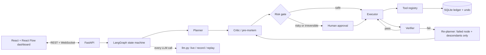

# Sutradhar AI: Goals in, done out

Type a one-line goal in English, Hindi or Marathi. A team of agents plans a task graph, rehearses failure (pre-mortem), executes with tools, verifies each step, and **re-plans only the broken branch** when something fails. Humans approve risky steps; every action is logged with an undo.

## Quick start (Windows)
1. One-time setup
   ```powershell
   cd backend; py -3.11 -m venv .venv; .venv\Scripts\python.exe -m pip install -r requirements.txt; cd ..
   cd frontend; npm install; cd ..
   copy .env.example .env     # then open .env and paste GEMINI_API_KEY=...
   ```
2. Double-click **start.bat** (backend :8000, frontend :5173, opens the browser).
3. Demo mode (toggle on, default) replays recorded AI responses from `backend/cassettes/techfest.json`: **no Wi-Fi and no API key needed**. Turn it off to use the live LLM.

Re-record the cassette (needs a key): `backend\.venv\Scripts\python.exe backend\scripts\record_demo.py`. Verify replay: add `--check`.
Tests (from `backend/`): `.venv\Scripts\python.exe -m pytest -q`.

## Architecture


| Piece | Where |
|---|---|
| Agents + prompts | `backend/app/{planner,critic,executor,verifier,replanner}.py`, `backend/app/prompts/*.md` |
| State machine | `backend/app/orchestrator.py` |
| Tools (plug-in registry: drop a file in `app/tools/`) | `backend/app/tools/` |
| Ledger + undo | `backend/app/ledger.py` |
| LLM layer (live/record/replay, 429 backoff) | `backend/app/llm.py` |
| Dashboard | `frontend/src/` |

Config (`.env`): `LLM_MODE=live|record|replay`, `RISK_THRESHOLD`, `STEP_DELAY` / `RUN_DELAY` (demo pacing, seconds).
Gmail, Calendar and Sheets are sandboxed adapters (outbox, calendar, real .xlsx); storage is SQLite.
